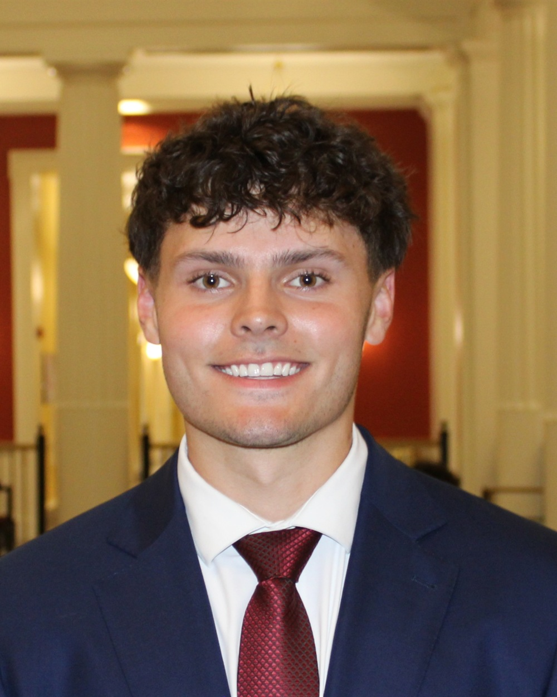

# Image Assets — What to get, where it goes

Every image on the site is currently a labeled SVG placeholder. Replace the files in
`assets/` with real images using the **exact filenames** below and the site picks them
up with no code changes.

---

## Rule of thumb: what to shoot vs. what to generate

| Image | Source | Why |
|---|---|---|
| Hero campus photo | **Real photo only** | An AI-generated "Miami University" is a building that doesn't exist. People from Oxford will spot it instantly and it undermines the whole point of looking legitimate. |
| Exec headshots | **Real photos only** | These are real people. Obviously. |
| Meeting / presentation shots | **Real photos, once you have them** | Same credibility issue. AI-generated "students in a classroom" reads as stock-photo fake. |
| Abstract textures, backgrounds, social graphics | AI-generated is fine | Nothing is being misrepresented. |

**Short version: for launch, shoot real photos of the two things you control (your exec board and your meetings) and source a real licensed campus photo. Save AI generation for decorative/abstract assets.**

---

## 1. Hero background — `assets/hero-campus.jpg`

**Replaces:** `assets/placeholder-hero.svg`
**Then edit `index.html`:** change the hero `` to `assets/hero-campus.jpg`

**Specs**
- 2400 × 1350 minimum (it goes full-bleed on large monitors)
- Landscape, horizontal
- The left ~45% of the frame should be relatively uncluttered — the headline sits there over a dark gradient
- Warm light strongly preferred (golden hour, early fall). Avoid flat gray overcast — it'll look dreary under the dark scrim
- Export as JPG at ~80% quality, then compress at [squoosh.app](https://squoosh.app) to get under ~400 KB

**Where to get a real one, in order of preference**
1. **Shoot it yourself.** Sunset over Slant Walk, the Seal, Upham Arch, or the Farmer School building. A recent iPhone is more than enough resolution. This is the best option — it's authentically yours and there are zero licensing questions.
2. **Miami University Photo Library** — Miami's University Communications & Marketing office maintains official campus photography for university-affiliated use. As a registered student org you're likely eligible; email them and ask. This also gets you brand-compliant imagery.
3. **Unsplash / Pexels** — search "Miami University Oxford Ohio". Free for commercial use, no attribution required. Verify it's actually Miami and not University of Miami (Florida) — this is a very common mixup and would be an embarrassing mistake.

**Best subjects:** Upham Hall arch, Slant Walk in fall color, the Seal at Hub, McGuffey Hall, Armstrong Student Center exterior at dusk, or an aerial of central campus.

---

## 2. Meeting photo — `assets/meeting.jpg`

**Replaces:** the first `placeholder-wide.svg` in the About section
**Aspect:** 4:3, at least 1200 × 900

Candid shot of your exec board or members around a table with laptops open, mid-discussion. Not posed, not everyone staring at the camera. Shoot this at your first real meeting.

**Until you have one:** it's genuinely better to delete the `<figure>` block from the About section than to use a fake stock photo. An honest text-only section beats an obviously-stock image.

---

## 3. Client presentation photo — `assets/client-presentation.jpg`

**Replaces:** the second `placeholder-wide.svg` in the Client Work section
**Aspect:** 4:3, at least 1200 × 900

Students presenting — someone standing, a slide on screen, people watching. You won't have this until your first semester wraps. Same advice: remove the figure rather than fake it.

---

## 4. Exec headshots — ✅ 8 of 9 live

Eight are in `assets/team/`, generated from the LinkedIn downloads by
`process-headshots.ps1` — center-cropped to 4:5, resized to 800 × 1000, JPEG q82,
44–185 KB each. EXIF rotation is honored and the crop is biased slightly toward the top
so heads don't get sliced off.

**Still needed: Claire Richardson.** Put her source file in `Downloads`, add an entry to
the `$map` in `process-headshots.ps1`, and re-run it.

**Fixing a crop.** Sources ranged from a 400 × 400 thumbnail (Aidan) to a 6000 × 4000
landscape DSLR frame (Ryan), so auto-cropping won't be perfect on all of them. If a face
sits too high or low, add a focus override to that one ``:

```html

```

Second value is the vertical anchor — **lower % = more headroom**, higher % = more chin.
Default is `50% 28%`.

**Worth doing before launch: reshoot all nine in one session.** The current set is
normalized to the same frame but still varies in lighting, background, and distance, and
that mismatch is the main thing between this and looking properly established.
30 minutes, everyone at once:
- Same location, same time of day — outdoors in open shade is the most forgiving light
  there is (north side of a building, overcast day, or under tree canopy)
- One uniform background: brick wall, greenery, or a plain building face
- Loose dress code so it reads as one group: business casual, no loud patterns or logos
- Shoot portrait orientation, subject a few feet off the background
- Drop the files in and re-run the script — it handles cropping and compression

Consistency across the set matters more than any individual photo's quality.

---

## 5. Logo — `assets/logo.svg`

**Currently a vector reconstruction of your real mark** — red wing, red ring, black
field, RedHawk / Applied AI wordmark, built to match the proportions of the file you
sent. It is a rebuild, not your actual artwork.

**Replace it when you can.** If you have the original vector (Illustrator, Figma,
Canva), export **SVG** and just overwrite `assets/logo.svg` — no code change needed.

If all you have is the raster PNG, save it as `assets/logo.png` at 512 × 512 or larger
and update the two `` references in `index.html` (nav and
footer).

> Caveat on the reconstruction: the wordmark renders in a system sans (Arial), because
> an SVG loaded through `` cannot pull in a webfont. At nav size (42 px) it reads
> as a mark rather than as text, so it's invisible in practice — but it's the reason
> swapping in the real file is still worth doing.

---

# AI generation prompts — decorative assets only

Use these anywhere you want texture, social graphics, or slide backgrounds. **Do not use
these to fabricate campus, people, or events.** Works in Midjourney, DALL·E, Firefly, or
whatever you prefer.

### A. Abstract network / neural texture (section backgrounds, slides)
```
Abstract minimal data network visualization, thin interconnected lines and small nodes,
crimson red accent nodes on a warm off-white background, generous negative space,
soft depth of field, editorial tech aesthetic, clean and professional, no text,
no logos, 16:9
```

### B. Dark version of the same (for the dark bands)
```
Abstract minimal network of thin luminous lines and nodes, deep charcoal near-black
background, subtle crimson red glow on select nodes, high negative space, cinematic
soft focus, premium editorial technology aesthetic, no text, no people, 16:9
```

### C. Paper / texture overlay (subtle warmth over light sections)
```
Subtle warm off-white paper texture, very fine grain, soft uneven natural lighting,
extremely low contrast, seamless, minimal, no pattern repetition, no text
```

### D. Instagram announcement background (social, not the site)
```
Minimal geometric abstract composition, crimson red and warm cream color blocking,
clean diagonal division, subtle grain texture, lots of empty space in the center for
text overlay, modern collegiate branding aesthetic, no text, 4:5 vertical
```

### E. Gradient mesh accent (hero fallback if you truly can't source a photo)
```
Soft abstract gradient mesh, deep charcoal transitioning to muted crimson, smooth
organic flow, subtle film grain, dark and moody, premium minimal, no objects,
no text, 16:9
```
> Only use E as a last resort. A real campus photo is dramatically more effective —
> it says "we're a real org at a real school" in a way no gradient can.

---

# Compression checklist before deploying

Large images are the fastest way to make a nice site feel cheap.

1. Resize to the largest size actually needed (hero 2400px wide; everything else 1200px)
2. Run every file through [squoosh.app](https://squoosh.app)
3. Export **WebP** at ~80% quality where you can — 30–50% smaller than JPG at the same visual quality
4. Targets: hero under ~400 KB, other photos under ~150 KB, headshots under ~80 KB each
